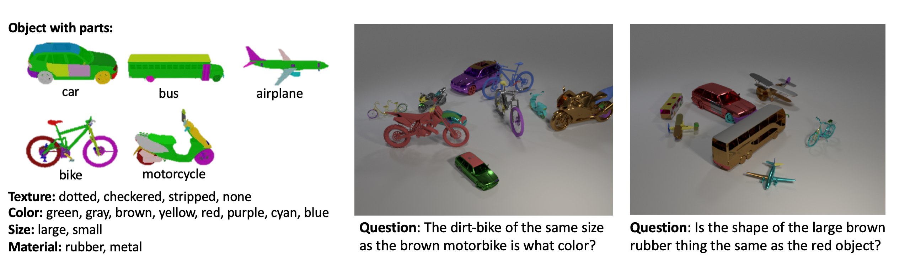

# Super-CLEVR: A Virtual Benchmark to Diagnose Domain Robustness in Visual Reasoning


This is the homepage for the paper: 

[Super-CLEVR: A Virtual Benchmark to Diagnose Domain Robustness in Visual Reasoning](https://arxiv.org/abs/2212.00259) [CVPR 2023 highlight (top 2.5%)]

[Zhuowan Li](https://lizw14.github.io/), [Xingrui Wang](https://xingruiwang.github.io), [Elias Stengel-Eskin](https://esteng.github.io), [Adam Kortylewski](https://gvrl.mpi-inf.mpg.de/), [Wufei Ma](https://wufeim.github.io), [Benjamin Van Durme](https://www.cs.jhu.edu/~vandurme/), [Alan Yuille](https://www.cs.jhu.edu/~ayuille/).

------------

[PDF](https://arxiv.org/pdf/2212.00259.pdf)
[Slides](https://www.cs.jhu.edu/~zhuowan/zhuowan/SuperCLEVR/documents/Super-CLEVR.pdf)
[Poster](https://www.cs.jhu.edu/~zhuowan/zhuowan/SuperCLEVR/documents/poster.pdf)
[Video](https://www.youtube.com/watch?v=DWRp_70ypiA)
<!-- (https://www.cs.jhu.edu/~zhuowan/zhuowan/SuperCLEVR/obj_part_list/all_objects.html) -->

------------
In this paper, we generate the Super-CLEVR dataset to systematically study the domain robustness of visual reasoning models on four factors: visual complexity, question redundancy, concept distribution, concept compositionality.

------------
## Dataset
Super-CLEVR contains 30k images of vehicles (from [the UDA-Part Dataset](https://qliu24.github.io/udapart/)) randomly placed in the scenes, with 10 question-answer pairs for each image. The vehicles have part annotations and so the objects in the images can have distinct part attributes. 

Here [[link]](https://www.cs.jhu.edu/~zhuowan/zhuowan/SuperCLEVR/obj_part_list/all_objects.html) is the list of objects and parts in Super-CLEVR scenes. 

<div align="center">
  
</div>

The first 20k images and paired are used for training, the next 5k for validation and the last 5k for testing.

| Data                     |Download Link|
|--------------------------|---|
| images                   |[images.zip](https://www.cs.jhu.edu/~zhuowan/zhuowan/SuperCLEVR/to_be_released/images.zip)|
| scenes                   |[superCLEVR_scenes.json](https://www.cs.jhu.edu/~zhuowan/zhuowan/SuperCLEVR/to_be_released/superCLEVR_scenes.json)|
| questions                |[superCLEVR_questions_30k.json](https://www.cs.jhu.edu/~zhuowan/zhuowan/SuperCLEVR/to_be_released/superCLEVR_questions_30k.json) (to be updated)|
| questions (- redundancy) |[superCLEVR_questions_30k_NoRedundant.json](https://www.cs.jhu.edu/~zhuowan/zhuowan/SuperCLEVR/to_be_released/superCLEVR_questions_30k_NoRedundant.json)|
| questions (+ redundancy)  |[superCLEVR_questions_30k_AllRedundant.json](https://www.cs.jhu.edu/~zhuowan/zhuowan/SuperCLEVR/to_be_released/superCLEVR_questions_30k_AllRedundant.json)|


--------------

## Dataset generation
### To generate images:
1. Install Blender 2.79b. This repo is highly built on the [CLEVR data generation code](https://github.com/facebookresearch/clevr-dataset-gen). Please refer to its `README` for additional details.
2. Download [CGPart dataset](https://github.com/qliu24/render-3d-segmentation). 
3. Then we want to preprocess the 3D models. To do this, you may need to modify the input and output paths in `image_generation/preprocess_cgpart.py`, then run `sh scripts/preprocess_cgpart.py`. 
4. Next run `sh scripts/render_images.sh` to render images with GPUs. 
5. After the images and corresponding scene files are generated, you can use `scripts/merge_scenes.py` to merge the scene files into one json file (as `output/superCLEVR_scenes.json`).

10 example generated images and scenes are in `output/images` and `output/scenes`. `output/superCLEVR_scenes_100mb.json` contains scene info for all (25k) generated images, which are then be used to generated questions.

### To generate questions
run `sh scripts/generate_questions.sh`. This bash file include several different scripts for generate questions with/without parts.

`output/superCLEVR_questions_5.json` and `outputsuperCLEVR_questions_part_5.json` are examples for questions generated using templates without and with parts respectively.

-----------
## Aknowledgements
This repo is highly motivated by [CLEVR](https://github.com/facebookresearch/clevr-dataset-gen) and [CaliCO](https://github.com/Lizw14/CaliCO).

--------------
## Citation
If you find this code useful in your research then please cite:

```
@inproceedings{li2023super,
  title={Super-CLEVR: A Virtual Benchmark to Diagnose Domain Robustness in Visual Reasoning},
  author={Li, Zhuowan and Wang, Xingrui and Stengel-Eskin, Elias and Kortylewski, Adam and Ma, Wufei and Van Durme, Benjamin and Yuille, Alan L},
  booktitle={Proceedings of the IEEE/CVF Conference on Computer Vision and Pattern Recognition},
  pages={14963--14973},
  year={2023}
}
```